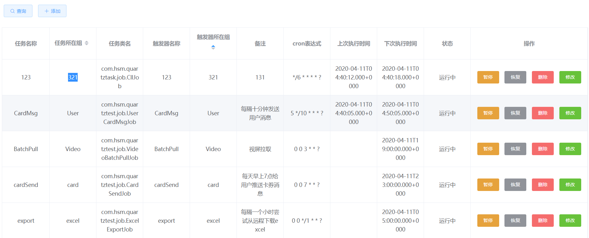

# quartz页面管理
## 1.介绍
本项目主要使用spring boot集成quartz定时任务,实现简单的定时任务的管理,包括:
1. 任务job类扫描功能
2. 新增定时任务
3. 删除定时任务
4. 暂停定时任务
5. 恢复定时任务
6. 修改定时任务启动时间
7. 定时任务半持久化操作
8. 定时任务列表查询

## 2.主要表结构
```sql
CREATE TABLE `job_trigger` (
  `id` int(11) NOT NULL AUTO_INCREMENT,
  `job_name` varchar(64) DEFAULT NULL,
  `job_group` varchar(64) DEFAULT NULL,
  `job_class` varchar(64) DEFAULT NULL,
  `trigger_name` varchar(255) DEFAULT NULL,
  `trigger_Group` varchar(255) DEFAULT NULL,
  `cron_expression` varchar(255) DEFAULT NULL,
  `trigger_state` varchar(10) DEFAULT NULL,
  `ctime` bigint(13) DEFAULT NULL,
  `description` varchar(128) DEFAULT NULL,
  PRIMARY KEY (`id`),
  UNIQUE KEY `uk_uni` (`job_name`,`job_group`,`description`) USING BTREE
) ENGINE=InnoDB AUTO_INCREMENT=6 DEFAULT CHARSET=utf8mb4;
```
## 3. 使用
### 3.1 quartz-task-1.0.0分支
1. 需要将表结构运行在数据库中,数据库的目的主要是为了让任务可以在项目重启时自动重启
2. 拉取quartz-task-1.0.0的代码直接运行即可
### 3.2 master分支
这里没有上传到公有仓库,你可以直接使用mvn install 安装到自己的本地仓库中
详细demo:[github demo](https://github.com/Steven-hsm/learnexample/tree/master/quart-test)
#### 3.2.1 引入依赖
```xml
    <dependency>
        <groupId>com.hsm</groupId>
        <artifactId>quartz-task</artifactId>
        <version>0.0.1-SNAPSHOT</version>
    </dependency>
```
#### 3.2.2 编写启动类
```java
@SpringBootApplication(scanBasePackages = {"com.hsm.quartztask"})
@MapperScan("com.hsm.quartztask.mapper")
public class QuartzTaskApplication {
    public static void main(String[] args) {
        SpringApplication.run(QuartzTaskApplication.class, args);
    }
}
```
#### 3.2.2.3 编写需要的定时任务job
代码请写在配置文件中配置的包下
```java
@Slf4j
public class VideoBatchPullJob implements BaseJob {
    @Override
    public void execute(JobExecutionContext jobExecutionContext) throws JobExecutionException {
        log.info("视屏批量下载任务正在启动中");
    }
}
```
#### 3.2.2.4 spring配置文件示例
```yaml
server:
  port: 8080
spring:
  quartz:
    job:
      # job任务所在的包
      package: com.hsm.quartztest.job;com.hsm.quartztask.job
  #数据源配置
  datasource:
    driver-class-name: com.mysql.cj.jdbc.Driver
    #schema: classpath:db/schema-h2.sql
    #data: classpath:db/data-h2.sql
    url: jdbc:mysql://127.0.0.1:3306/spring-boot-demo?useUnicode=true&characterEncoding=utf8&useSSL=false&allowPublicKeyRetrieval=true&serverTimezone=UTC
    username: root
    password: root
mybatis-plus:
  mapper-locations: classpath*:mapper/**/*.xml
  type-aliases-package: com.doyd.legalright.po
# Logger Config
logging:
  level:
    com.baomidou.mybatisplus.samples.quickstart: debug
```
#### 3.2.2.5 运行结果展示
地址:http://localhost:8080/job.html



